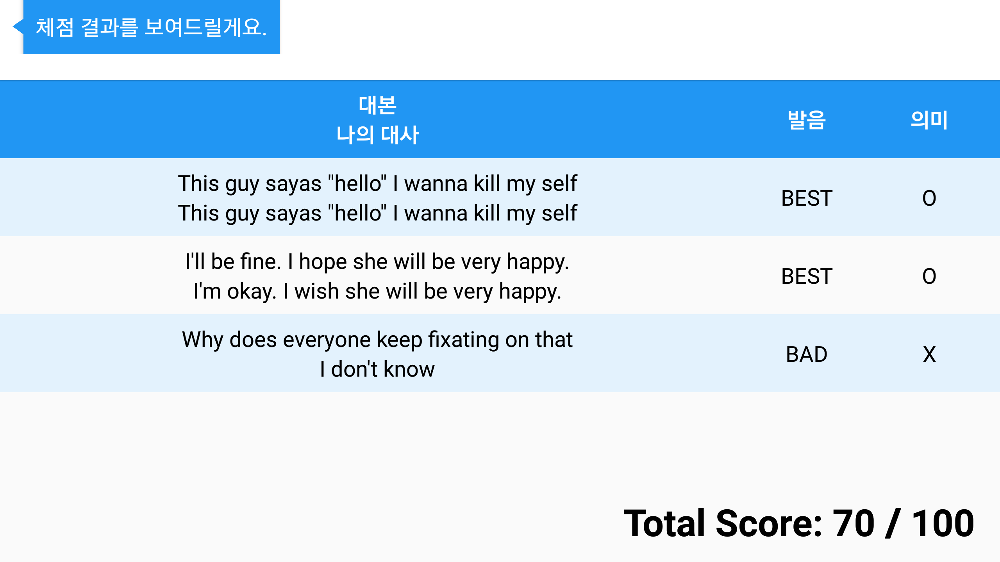

# Handy Tutor
Handy Tutor is an English conversation learning application using English video contents based on AI speaker.

## Screen SHot

# Handy Tutor Server
## How to install
<pre>
  $ git clone https://github.com/HandyTutor/handy_tutor_server
  $ git cd handy_tutor_server
  $ pip install virtualenv
  $ virtualenv env
  $ source env/bin/activate
  $ pip install flask
  $ pip install pymysql
  $ pip install gensim
  $ pip install numpy
</pre>

## How to run
<pre>
  $ cd ~/handy_tutor_server
  $ source env/bin/activate
  $ python server.py
</pre>
